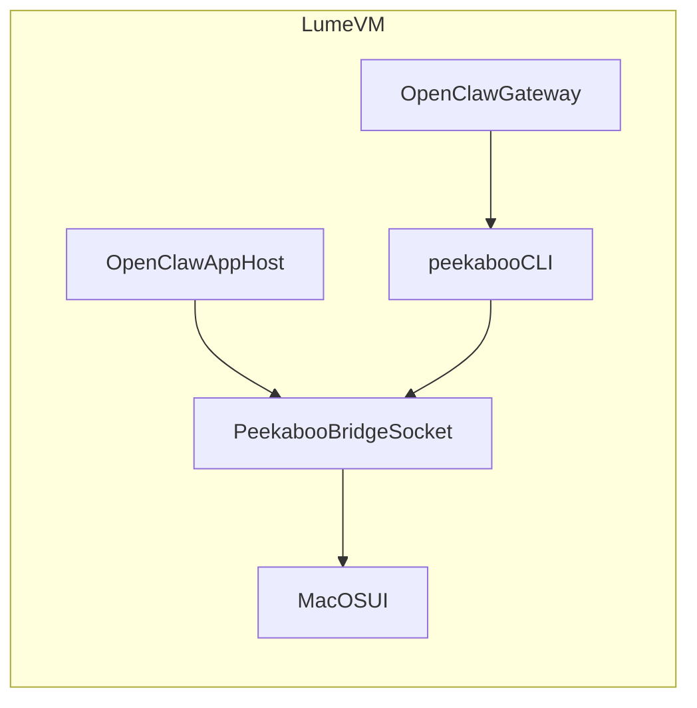

# Peekaboo Bridge in Lume VM Plan

## 1. Context & goal

Enable OpenClaw to **see and automate the macOS UI inside the Lume VM** by setting up **Peekaboo Bridge** in the VM. The Control UI is only a web dashboard; UI vision requires a Peekaboo host (OpenClaw.app or Peekaboo.app) running **inside** the VM with the right macOS permissions. We will document the setup and use the existing SSH helper scripts to execute the VM-side commands, while acknowledging that macOS permissions must be granted via the VM UI.

Key constraints:

- The Peekaboo host must run **inside the VM** to capture the VM’s screen.
- macOS TCC permissions (Screen Recording, Accessibility) require **manual** approval via the VM UI.
- We must keep the flow runnable using the existing scripts (`ssh-vm.sh`, `openclaw-in-vm.sh`).

## 2. Codebase research summary

Inspected files:

- [runbook-lume-claw-setup.md](/Users/guillaumedieudonne/Desktop/lume-moltbot/docs/runbook-lume-claw-setup.md) — current VM setup and OpenClaw install, no Peekaboo section.
- [README.md](/Users/guillaumedieudonne/Desktop/lume-moltbot/README.md) — lists scripts and runbook, no Peekaboo mention.

Relevant external docs:

- **Peekaboo Bridge (macOS UI automation)**: [https://docs.openclaw.ai/platforms/mac/peekaboo](https://docs.openclaw.ai/platforms/mac/peekaboo)
- **Control UI (browser dashboard)**: [https://docs.openclaw.ai/web/control-ui](https://docs.openclaw.ai/web/control-ui)

What we learned:

- The Control UI is a human dashboard and does **not** enable the agent to see the macOS UI.
- Peekaboo Bridge requires a **macOS app host** (OpenClaw.app or Peekaboo.app) with TCC permissions, and the `peekaboo` CLI connects to that host.

## 3. High-level design

Use OpenClaw.app (macOS Companion) **inside the VM** as the Peekaboo host (simplest option), and keep the gateway + agent inside the VM. The agent uses the `peekaboo` CLI to request screen snapshots via the local Peekaboo bridge socket.

Key data flow:

- Agent request → gateway tool call → `peekaboo` CLI → Peekaboo Bridge → screen snapshot of VM UI

## 4. File & module changes

### Existing files to update

- [runbook-lume-claw-setup.md](/Users/guillaumedieudonne/Desktop/lume-moltbot/docs/runbook-lume-claw-setup.md)
  - Add a **Peekaboo Bridge in VM** section with:
    - Installing OpenClaw.app **inside the VM**
    - Enabling Peekaboo Bridge in the app settings
    - Granting macOS permissions (Screen Recording, Accessibility)
    - Installing `peekaboo` CLI inside the VM (via npm or brew)
    - Verifying with `peekaboo bridge status --verbose`
- [README.md](/Users/guillaumedieudonne/Desktop/lume-moltbot/README.md)
  - Add a short note + link to the new Peekaboo section/doc.

### New files to create

- [peekaboo-bridge.md](/Users/guillaumedieudonne/Desktop/lume-moltbot/docs/peekaboo-bridge.md)
  - Dedicated step-by-step guide for running Peekaboo Bridge **inside the VM**.
  - Include fallback option: Peekaboo.app as host if OpenClaw.app is unavailable.
  - Include troubleshooting (permissions, Gatekeeper “blocked app”, missing host).

### Optional (if needed)

- If we want a single command to verify the bridge, add a simple helper script (e.g. `scripts/peekaboo-status.sh`) that SSHs into the VM and runs `peekaboo bridge status --verbose`. This is optional since existing scripts already allow this.

## 5. Step-by-step tasks

1. **Documentation update (runbook)**
  - Add a section to [runbook-lume-claw-setup.md](/Users/guillaumedieudonne/Desktop/lume-moltbot/docs/runbook-lume-claw-setup.md) titled “Peekaboo Bridge (macOS UI automation) in the VM”.
  - Specify the host app (OpenClaw.app in VM), and the steps to enable the bridge and grant TCC permissions.
  - Include the commands to install `peekaboo` CLI using the existing scripts:
    - `./scripts/ssh-vm.sh` → run install steps in the VM.
    - or `./scripts/openclaw-in-vm.sh` to run a one‑liner.
2. **Add a dedicated Peekaboo guide**
  - Create [peekaboo-bridge.md](/Users/guillaumedieudonne/Desktop/lume-moltbot/docs/peekaboo-bridge.md) with:
    - Install OpenClaw.app in the VM (download + drag to Applications)
    - Open app → Settings → **Enable Peekaboo Bridge**
    - macOS permissions in the VM: **Screen Recording** + **Accessibility**
    - Install `peekaboo` CLI in VM
    - Verify: `peekaboo bridge status --verbose`
    - Troubleshooting: “bridge client not authorized”, Gatekeeper blocks, missing permissions
3. **README update**
  - Add a “Peekaboo Bridge (UI automation)” link in [README.md](/Users/guillaumedieudonne/Desktop/lume-moltbot/README.md).
4. **Validation checklist**
  - In the VM, confirm:
    - OpenClaw.app is running and bridge is enabled.
    - `peekaboo bridge status --verbose` shows the host and socket path.
    - Permissions are granted (Screen Recording + Accessibility).

## 6. Edge cases & risks

- **No UI dialog appears** when enabling permissions via SSH: must do permissions in the VM UI (VNC) because macOS prompts are GUI‑only.
- **Gatekeeper blocks the app**: allow in System Settings → Privacy & Security → Open Anyway.
- **Bridge client not authorized**: requires signed client or use debug‑only `PEEKABOO_ALLOW_UNSIGNED_SOCKET_CLIENTS=1` (per doc).
- **VM clipboard**: doesn’t affect bridge; use SSH or shared folder for copy/paste.

## 7. Testing strategy

- **Manual validation** in VM:
  - `peekaboo bridge status --verbose` shows a host (OpenClaw.app preferred).
  - OpenClaw agent can request a screenshot or run a test tool that uses `peekaboo`.
- **Regression check**: ensure existing OpenClaw gateway + TUI still work after enabling the bridge.

## 8. Rollout / migration

- No migration needed; changes are documentation and optional helper scripts.
- Encourage keeping the VM as a “golden image” once permissions and app installs are done.

## 9. TODO checklist

**Docs**

- Add Peekaboo section to [runbook-lume-claw-setup.md](/Users/guillaumedieudonne/Desktop/lume-moltbot/docs/runbook-lume-claw-setup.md)
- Create [peekaboo-bridge.md](/Users/guillaumedieudonne/Desktop/lume-moltbot/docs/peekaboo-bridge.md)
- Add Peekaboo link to [README.md](/Users/guillaumedieudonne/Desktop/lume-moltbot/README.md)

**Optional helper**

- (Optional) Add a `peekaboo-status` helper script that runs `peekaboo bridge status --verbose` via SSH

**Manual QA**

- Enable Peekaboo Bridge in OpenClaw.app inside the VM
- Grant Screen Recording + Accessibility permissions in the VM
- Verify bridge status via `peekaboo bridge status --verbose`

